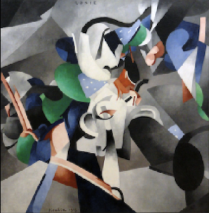
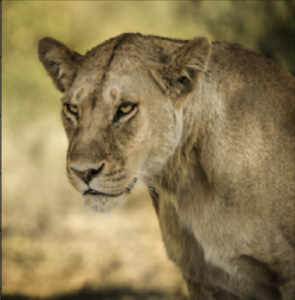
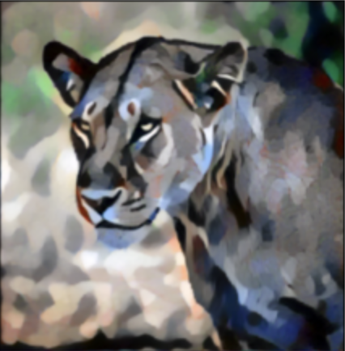

# Style Transfer in PyTorch
Neural Style Transfer challenge by Fellowship.ai

### Changes made -
1. Loaded the image using Image class from PIL and converted into a tensor using transforms function from torchvision package.
2. Added Mean Squared Loss function in ContentLoss to calculate the content loss.
3. Added image normalization code.
4. Initialized Content and Style losses arrays to store the loss at each epoch.
5. Training and Evaluation:
    - Freezing the model using model.required_grad_(False).
    - Updated input image by using torch.no_grad() i.e stopping autograd from calculating the gradients during the evaluation phase.
    - Added loss.backward() to compute the gradients.

### Style Image

### Content Image

### Styled Output

